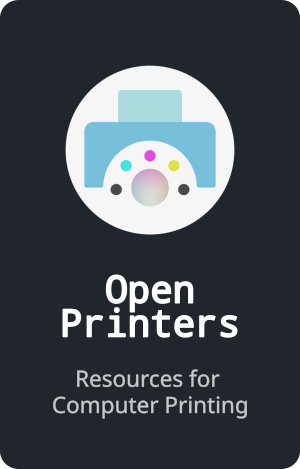

 

<!--
[][OmegaTools]       
[][Pordeno]       
[][ServedSpicy]

 

[][OutLinked]       
[][OpenPrinters]       
[][NativeMessaging]
-->

[][JSLess]       
[][Chibis]

 

<!--

    <a rel="me" href="https://mastodon.social/@Phonedroid">Mastodon</a>

-->

<!----------------------------------------------------------------------------->

[NativeMessaging]: https://github.com/NativeMessaging
[OpenPrinters]: https://github.com/OpenPrinters
[ServedSpicy]: https://github.com/ServedSpicy
[OmegaTools]: https://github.com/OmegaTools
[OutLinked]: https://github.com/OutLinked
[Pordeno]: https://github.com/Pordeno
[Chibis]: https://github.com/NiniNoChibi
[JSLess]: https://github.com/JSLess

